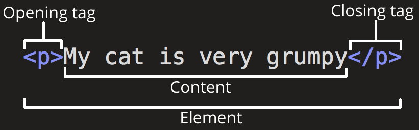
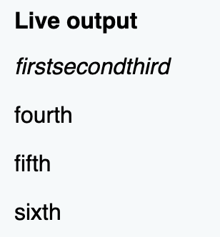
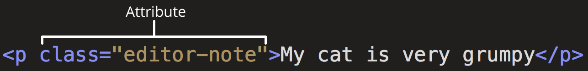

# HTML 기본 학습

2020.08.25 - 최형동<br/><br/><br/>

## **HTML 이란?**

- Hypertext Markup Language(HTML)
- 프로그래밍 언어라고 하기엔 무리가 있고, 우리가 보는 웹페이지가 어떻게 구조화되어 있는지 브라우저로 하여금 알 수 있도록 하는 마크업 언어입니다.
- elements로 구성되어 있으며, 각 컨텐츠의 여러 부분들을 감싸고 마크업 합니다.
- tags를 사용하여 웹 상에서 다른 페이지로 이동하는 하이퍼링크 내용들을 생성하거나, 단어를 강조하는 등의 역할을 합니다.
- HTML 요소는 대소문자를 구분하지 않습니다. 하지만 대게는 가독성과 기타 이유때문에 소문자로 작성합니다.
  <br/><br/><br/>
  
  <br/><br/><br/>

## **HTML 요소**

- **블럭 레벨 요소(Block-level elements)**

  - 웹페이지 상에 블록(Block)을 만드는 요소.
  - 블록 레벨 요소는 앞뒤 요소 사이에 새로운 줄(Line)을 만들고 나타납니다.
  - 블록 레벨 요소는 일반적으로 페이지의 구조적 요소를 나타낼 때 사용됩니다 (ex. 단락, 목록, 네비게이션 메뉴, 꼬리말 등...).
  - 블록 레벨 요소는 인라인 요소(Inline elements)에 중첩될수 없습니다. 그러나 블록 레벨 요소는 다른 블록 레벨 요소에 중첩될 수 있습니다.

  **[블럭레벨 요소 전체 목록 보기](https://developer.mozilla.org/ko/docs/Web/HTML/Block-level_elements)**

- **인라인 요소(Inline elements)**

  - 인라인 요소는 항상 블록 레벨 요소내에 포함되어 있습니다.
  - 인라인 요소는 문서의 한 단락같은 큰 범위에는 적용될 수 없고 문장, 단어 같은 작은 부분에 대해서만 적용될 수 있습니다.<br/>(ex 하이퍼링크를 정의하는 요소인 `<a>` , 텍스트(Text)를 강조하는 요소인 `<em>,<strong>` 등...)
  - 인라인 요소는 새로운 줄(Line)을 만들지 않습니다.

  **[인라인 요소 전체 목록 보기](https://developer.mozilla.org/ko/docs/Web/HTML/Inline_elements)**

  ex)

  ```html
  <em>first</em><em>second</em><em>third</em>

  <p>fourth</p>
  <p>fifth</p>
  <p>sixth</p>
  ```

  

- **빈 요소(Empty elements) (=Void 요소)**
  - 모든 요소가 여는 태그, 내용, 닫는 태그 패턴을 따르는 것은 아닙니다. 주로 문서에 무언가를 첨부하기 위해 단일 태그(Single tag)를 사용하는 요소도 있습니다. 예를 들어  요소는 해당 위치에 이미지를 삽입하기 위한 요소입니다.

<br/><br/><br/>

## **HTML 속성**

- 속성은 요소에 실제론 나타내고 싶지 않지만 추가적인 내용을 담고 싶을 때 사용합니다. ex) class 속성
  <br/><br/>
  
- 요소 이름 다음에 바로 오는 속성은 요소 이름과 속성 사이에 공백이 있어야 되고, 하나 이상의 속성들이 있는 경우엔 속성 사이에 공백이 있어야 합니다.
- 속성 이름 다음엔 ' = ' 가 붙습니다.
- 속성 값은 열고 닫는 따옴표로 감싸야 합니다.
- 큰 따옴표, 작은 따옴표 둘다 사용해도 되지만 열고 닫을때는 꼭 같은 종류의 따옴표를 감싸 주어야 합니다.
- `title='Isn't this fun?'` 처럼 따옴표 안에 같은 따옴표를 사용하고 싶다면 **[여기를 참고 하세요](https://developer.mozilla.org/en-US/docs/Learn/HTML/Introduction_to_HTML/Getting_started#Entity_references_Including_special_characters_in_HTML)**

**[속성 전체 목록 보기](https://developer.mozilla.org/en-US/docs/Web/HTML/Attributes)**
<br/><br/><br/>

## **HTML 문서의 구조**

```html
<!DOCTYPE html>
<html>
  <head>
    <meta charset="utf-8" />
    <title>My test page</title>
  </head>
  <body>
    <p>This is my page</p>
  </body>
</html>
```

`<!DOCTYPE html>`

- HTML5를 사용함을 브라우저에 알려줍니다. 브라우저는 스스로 HTML 문서의 버전을 판단하기 어렵기 때문에 우리가 직접 알려줘야 합니다.

`<html></html>`

- 이 요소는 전체 페이지의 콘텐츠를 포함하며, 기본 요소로도 알려져 있습니다. 하나만 존재해야 하고 html 바깥에 DOCTYPE을 제외한 다른 태그가 있으면 안 됩니다.

`<head></head>`

- HTML 페이지의 모든 내용을 담고 있습니다. 하나만 존재해야하고, html 태크 바로 아래에 있어야합니다.

`<meta charset="utf-8">`

- 이 요소는 HTML 문서의 문자 인코딩 설정을 UTF-8로 지정하는 것이며 예시에서 지정한 UTF-8에는 전세계에서 사용되는 언어에 대한 대부분의 문자가 포함됩니다.

`<title></title>`

- 이 요소를 사용하면 페이지 제목이 설정되며 페이지가 로드되는 브라우저 탭에 표시되는 제목으로 사용됩니다. 페이지 제목은 페이지가 책갈피 될 때 페이지를 설명하는 데에도 사용됩니다.

`<body></body>`

- 실제적으로 보여지는 부분을 나타냅니다. 텍스트, 이미지, 비디오, 게임, 재생 가능한 오디오 트랙 등을 비롯하여 페이지에 표시되는 모든 콘텐츠가 포함됩니다.

## **HTML 주석**

```html
<p>I'm not inside a comment</p>

<!-- <p>I am!</p> -->
```

<br/><br/>

### 참고 사이트

- https://velog.io/@brviolet/%EB%A1%9C%EB%93%9C%EB%A7%B5-%EA%B8%B8%EB%A7%8C-%EA%B1%B8%EC%96%B4%EC%9A%94-HTML
- https://developer.mozilla.org/ko/docs/Learn/HTML/Introduction_to_HTML/Getting_started
- https://www.zerocho.com/category/HTML&DOM/post/58177daee4184c0015b8058a
