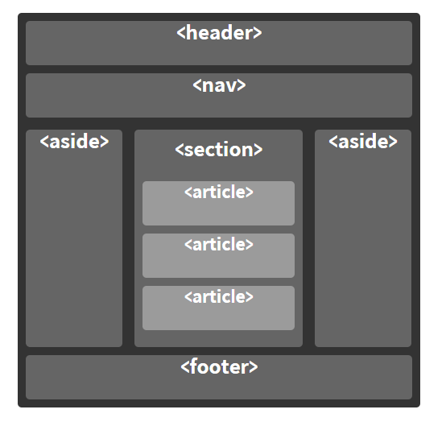

# 의미론적인 HTML 작성

2020.08.25 최형동
   

## **시멘틱 마크업 이란?**

컴퓨터가 웹 정보자원의 의미를 이해할 수 있도록 문서의 논리적인 구조를 문서의 의미 또는 어플리케이션 의미에 맞게 html을 작성하는 것을 말한다.

   

## **시멘틱 마크업 작성에는 어떤 장점이 있을까?**

- 웹 접근성이 좋아짐
  - 장애인,고령자 등이 웹 사이트에서 제공하는 정보에 비장애인과 동등하게 접근하고 이해할 수 있도록 보장하는 것을 말한다. 스크린 리더는 시각장애인들을 위한 프로그램인데, 이런 분들에게 브라우저의 내용을 음성으로 알려주는 측면에서도 시맨틱 마크업을 사용한다.
      
- 검색 엔진 SEO(Search Engine Optimization) 최적화
  - 우리가 검색을 하게 되면 브라우저는 검색엔진을 통해 정보를 제공해준다.
  - 이때 검색 엔진은 로봇(Robot)이라는 프로그램을 이용해 검색엔진의 크롤러가 웹 사이트 정보를 수집한다.(크롤링)
  - 검색 로봇이 수집한 정보는 HTML 코드이고, 검색엔진은 HTML 코드인 시맨틱 요소를 해석하게 된다.
  - 그렇기 때문에 시맨틱 요소로 HTML 문서를 작성하는 것은 검색 엔진에 더 잘 노출시킬 수 있다.
      
- 수정이 용이해짐
    
- 코드 가독성이 좋아짐
  - 내가 작성한 코드를 다른 개발자분들이 봤을 때 div 태그를 주로 사용하여 만든 코드 보다는 '의미' 와 '관련성'을 가진 시맨틱 마크업으로 작성한다면 리딩 시간을 절약할 수도 있고 쉽게 파악이 가능해질 것이다.
      
- 코드와 데이터의 재사용성이 높아짐
     

## **자주 사용되는 시맨틱 태그의 종류**

   

- `<header>` 
  페이지에서 상단에 위치하여 로고나 메뉴, 사이트의 소개, 정보 등을 넣습니다.

- `<nav>` 
  네비게이션 역할을 하는 태그로 보통 메뉴 영역으로 사용합니다. `<header>` 안에 사용하여 홈페이지의 공통 영역으로 사용하는 경우가 많지만 독립적으로 사용되는 경우도 있습니다

- `<section>`  
  주로 컨텐츠 영역을 나타낼 때 사용한니다. 컨텐츠를 주제별로 묶어서 사용합니다.
  `
` 의 개념과 비슷합니다.
  각각의 `<section>`을 식별할 수단이 필요합니다. 주로 제목(`<h1>-<h6>`) 요소를 `<section>`의 자식으로 포함하는 방법을 사용합니다.

- `<article>` 
  실질적인 내용이 들어가야 하는 영역으로 사용됩니다
  .각각의 `<article>`을 식별할 수단이 필요합니다. 주로 제목(`<h1>-<h6>`) 요소를 `<article>`의 자식으로 포함하는 방법을 사용합니다.

- `<aside>` 
  문서의 주요 내용과 간접적으로만 연관된 부분을 나타냅니다. 주로 사이드바 혹은 콜아웃 박스로 표현합니다.

- `<footer>`  
  페이지의 하단에 위치하여 문서의 footer를 나타낼 때 사용합니다.
  푸터는 일반적으로 구획의 작성자, 저작권 정보, 관련 문서 등의 내용을 담습니다.

- `<address>` 
  주로 footer안에 사용되고 사이트의 제작자 정보, 연락처 등을 적을 영역에 사용됩니다.

- `<main>` 
  해당 페이지의 메인 콘텐츠를 나타내고, main 요소는 한 페이지에서 한번만 사용이 가능하다.

## **[더많은 시멘틱 요소 보러가기](https://developer.mozilla.org/ko/docs/Glossary/Semantics#%EC%9D%98%EB%AF%B8%EB%A1%A0%EC%A0%81_%EC%9A%94%EC%86%8Celement%EB%93%A4)**

  

### 참고 사이트

- https://velog.io/@brviolet/%EB%A1%9C%EB%93%9C%EB%A7%B5-%EA%B8%B8%EB%A7%8C-%EA%B1%B8%EC%96%B4%EC%9A%94-HTML
- https://hsl1697.tistory.com/89
- https://velog.io/@kimu2370/%EC%8B%9C%EB%A7%A8%ED%8B%B1-%EB%A7%88%ED%81%AC%EC%97%85
- https://dev.eyegood.co.kr/entry/HTML5-CSS3-HTML5-%EC%8B%9C%EB%A7%A8%ED%8B%B1Semantic-%EB%A7%88%ED%81%AC%EC%97%85
- https://www.daleseo.com/html-semantic-markup/
