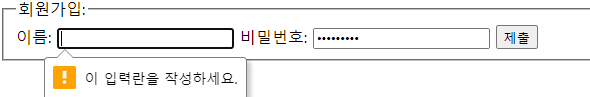

### Form and Validation

#### form
정보를 전달하기 위한 HTML element

#### Validation
유효성 검사

```html
    <form>
      <fieldset>
        <legend>회원가입:</legend>
        <label for="name">이름: </label>
        <input type="text" required />
        <label for="password">비밀번호: </label>
        <input type="password" required />
        <input type="submit" />
      </fieldset>
    </form>
```



##### 목적
올바른 형식의 데이터를 얻기 위해 사용
데이터를 보호하기 위해 사용

#### 옵션
- disabled: 사용 가능여부
- max: 최대값 지정
- min: 최소값 지정
- pattern: 정규식을 이용하여 값 확인
- required: 필수여부
- type: 입력값의 형식

#### CSS Pseudo-classes
옵션들은 CSS의 가상 선택자로 활용될 수도 있다.
- :disabled	
- :invalid
- :optional
- :required
- :valid

[MDN:Form](https://developer.mozilla.org/en-US/docs/Web/HTML/Element/form)
[w3schools:Form](https://www.w3schools.com/html/html_forms.asp)
[MDN:Form Validation](https://developer.mozilla.org/en-US/docs/Learn/Forms/Form_validation)
[w3schools:Form Validation](https://www.w3schools.com/js/js_validation.asp)

