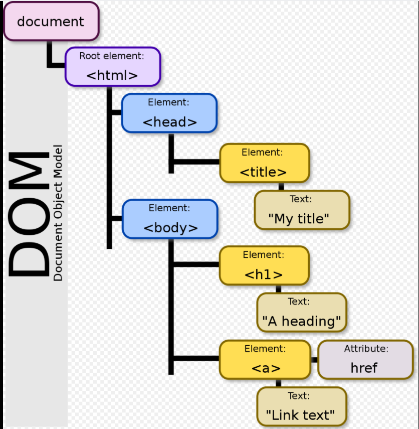

### DOM(Document Object Model)
문서를 객체로 표현 한 것

HTML, XML 문서의 프로그래밍 interface로 프로그래밍 언어가 DOM 구조에 접근하여 문서 구조, 스타일, 내용 등을 변경할 수 있게 돕는다.

DOM은 구조화된 nodes와 property와 method를 갖고 있는 objects로 문서를 표현한다.

##### XML (Extensible Markup Language)
데이터를 저장하고 전달할 목적으로 만들어짐

##### DOM 조작하기

- tagName : 엘리먼트의 태그명 반환
- textContent : 노드의 텍스트 내용을 설정하거나 반환
- nodeType : 노드의 노드 유형을 숫자로 반환

##### DOM 탐색 속성

- childNodes
엘리먼트의 자식 노드의 노드 리스트 반환(텍스트 노드, 주석 노드 포함)
[[예제]](https://jsbin.com/qabuciz/edit?html,js,console,output)

- firstChild
엘리먼트의 첫 번째 자식 노드를 반환
[[예제]](https://jsbin.com/fuconuk/1/edit?html,js,console,output)

- firstElementChild
첫 번째 자식 엘리먼트를 반환
[[예제]](https://jsbin.com/retoses/2/edit?html,js,console,output)

- parentElement
엘리먼트의 부모 엘리먼트 반환 
parentElement
[[예제]](https://jsbin.com/jonumig/2/edit?html,js,console,output)

- nextSibling
동일한 노드 트리 레벨에서 다음 노드를 반환 
nextSibling
[[예제]](https://jsbin.com/jonumig/6/edit?html,js,console,output)

- nextElementSibling
동일한 노드 트리 레벨에서 다음 엘리먼트 반환
nextElementSibling
[[예제]](https://jsbin.com/podawep/2/edit?html,js,console,output)

##### DOM 조작 메소드

- removeChild()
엘리먼트의 자식 노드 제거 
removeChild 
[[예제]](https://jsbin.com/lexobe/13/edit?html,js,console,output)

- appendChild()
마지막 자식 노드로 자식 노드를 엘리먼트에 추가
appendChild 
[[예제]](https://jsbin.com/wunocen/5/edit?html,js,console,output)

- insertBefore()
기존 자식노드 앞에 새 자식 노드를 추가
insertBefore 
[[예제]](https://jsbin.com/xogutix/5/edit?html,js,output)

- cloneNode()
노드를 복제
cloneNode 
[[예제]](https://jsbin.com/vecezowito/edit?html,js,output)

- replaceChild()
엘리먼트의 자식 노드 바꿈
replaceChild 
[[예제]](https://jsbin.com/rumadi/8/edit?html,js,output)

- closest()
상위로 올라가면서 가장 가까운 엘리먼트를 반환
closest 
[[예제]](https://jsbin.com/rumadi/13/edit?html,js,console,output)
 

##### HTML을 문자열로 처리해주는 DOM 속성 / 메소드

- innerText
지정된 노드와 모든 자손의 텍스트 내용을 설정하거나 반환
innerText 
[[예제]](https://jsbin.com/cexureyubo/edit?html,js,output)

- innerHTML
지정된 엘리먼트의 내부 html을 설정하거나 반환
innerHTML 
[[예제]](https://jsbin.com/sutejo/3/edit?html,js,output)

- insertAdjacentHTML()
HTML로 텍스트를 지정된 위치에 삽입
insertAdjacentHTML() 
[[예제]](https://jsbin.com/puwoqov/4/edit?html,js,output)

#### 출처

https://developer.mozilla.org/en-US/docs/Web/API/Document_Object_Model
https://developer.mozilla.org/ko/docs/Web/API/Document
https://en.wikipedia.org/wiki/Document_Object_Model#/
https://www.edwith.org/boostcourse-web/lecture/37422/