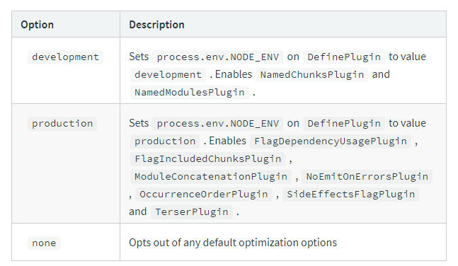

### webpack

https://webpack.js.org/concepts/

Core Concepts
- Entry: 웹팩이 사용할 시작점

`webpack.config.js`: 웹팩 설정 파일
```js
module.exports = {
  entry: './path/to/my/entry/file.js'
};
```

- Output: 번들 파일이 만들어질 장소와 번들 파일의 이름 정하기


```js
const path = require('path');

module.exports = {
  entry: './path/to/my/entry/file.js',
  output: {
    path: path.resolve(__dirname, 'dist'),
    filename: 'my-first-webpack.bundle.js'
  }
};

```
`path` 라이브러리는 Node.js module로 file path를 다룰 때 사용된다.
https://nodejs.org/api/path.html#path_path_resolve_paths


```js
path.resolve('/foo/bar', './baz');
// Returns: '/foo/bar/baz'

path.resolve('/foo/bar', '/tmp/file/');
// Returns: '/tmp/file'

path.resolve('wwwroot', 'static_files/png/', '../gif/image.gif');
// If the current working directory is /home/myself/node,
// this returns '/home/myself/node/wwwroot/static_files/gif/image.gif'
```

https://nodejs.org/api/path.html#path_path_resolve_paths
위의 예시와 사이트의 설명을 보면, path.resolve는 파라미터를 오른쪽에서 왼쪽 순으로 파라미터를 살피면서, 절대 경로가 완성될 때까지 파라미터를 합치게 된다.

2번예시를 보면 /tmp/file/ 이라는 절대경로가 완성되었기 때문에 /foo/bar는 반영되지 않는다.

기본적으로 path.resolve()는 해당 모듈의 위치를 가리킨다.

- Loaders
웹팩은 JS와 JSON files들만 이해하지만, Loader는 웹팩이 다른 유형의 파일들도 유효한 모듈로 변환할 수 있도록 도와준다.

```js
const path = require('path');

module.exports = {
  output: {
    filename: 'my-first-webpack.bundle.js'
  },
  module: {
    rules: [
      { test: /\.txt$/, use: 'raw-loader' }
    ]
  }
};

```
module.rules를 통해 test에는 적용될 파일의 확장자, use는 사용할 loader를 설정한다.

.txt확장자의 파일들을 import또는 require()를 통해 가져와 bundle 파일에 추가하기 전에 loader를 통해 변형시킨다.

- Plugins
플러그인을 활용하여 번들 최적화, asset, environment variables들을 관리한다.

```js
const HtmlWebpackPlugin = require('html-webpack-plugin'); //installed via npm
const webpack = require('webpack'); //to access built-in plugins

module.exports = {
  module: {
    rules: [
      { test: /\.txt$/, use: 'raw-loader' }
    ]
  },
  plugins: [
    new HtmlWebpackPlugin({template: './src/index.html'})
  ]
};
```
html-webpack-plugin은 생성된 모든 번들을 적용한 html파일을 만들어낸다.

- Mode
mode값으로 development, production, none을 사용할 수 있다.
https://webpack.js.org/configuration/mode/

default는 production값이다.
```js
module.exports = {
  mode: 'production'
};
CLI 명령어로 사용할 수 있다.

`webpack --mode=development`



```
- Brower Compatibility
webpack은 ES5를 준수 하는 모든 브라우저를 지원한다.

따라서 import 대신 require를 사용해야한다.
```   
