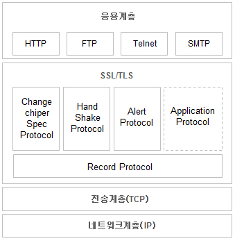

# HTTPS 란?

2020.09.02 최형동
   
HTTPS는 Hypertext Transfer Protocol Over Secure Socket Layer

SSL을 사용하면서 암호화와 증명서, 완전성 보호등을 이용할 수 있는 프로토콜

**HTTP + 통신의 암호화(SSL) + 증명서 + 리소스의 완전성 보호 = HTTPS**
  

## **HTTP의 약점**

- 암호화 하지 않은 통신이라 도청 가능 
  (주고받는 데이터가 평문으로 나타난다) : http에는 암호화 기능이 없다.
- 통신 상대를 확인하지 않기 때문에 위장 가능
- 완전성을 증명할 수 없기 때문에 변조 가능 : 서버에서 보낸, 혹은 클라이언트에서 보낸 리소스와 요청한 곳에서 받은 리소스가 완전히 일치하는지 확인할 수 없음

   

## **SSL(Secure Sockey Layer)**

보안 소켓 계층을 이르는 것으로, 인터넷 상에서 데이터를 안전하게 전송하기 위한 인터넷 암호화 통신 프로토콜을 말한다.
넷스케이프에서 처음 개발되었고, 시간이 지나 IETF에 의해 SSL3.0을 이용해TLS(Transport Layer Security)로 표준화 하였다.   즉, SSL == TLS이다.(기능상 차이가 있을 지는 모르지만 결국 SSL를 표준화한 것이 TLS이다.)
  

SSL/TSL 은 어느 계층에 속해있다고 이야기 하긴 힘들고, 응용계층과 전송계층 사이에서 동작하는 독립적인 프로토콜이다.   
HTTP는 직접 TCP와 통신하지만 SSL을 사용한 경우에는 HTTP는 SSL과 통신하고 SSL이 TCP와 통신한다. SSL이 껍질의 역할을 하는 것이다.
    

## **SSL은 비대칭키 암호화 방식을 사용한다**

SSL에서는 비대칭 키 암호화 방식이라 불리는 암호화 방식을 채용하고 있다.

- 대칭키 암호화

  - 암호화와 복호화에 하나의 공통키를 사용 하는 방식이다.
    이 방식은 상대방에게 키를 넘겨주지 않으면 안된다. 하지만 상대방에게 키를 보내주는 과정에서 키를 빼앗기면 암호화의 의미가 없어진다.
    노출되지 않는 100% 안전한 경로는 없기때문에 문제가 된다.

- 비대칭키 암호화
  - 키를 전달하지 않는 방법을 고안. 이 방법에선 서로다른 두개의 키 pair를 사용한다. 
    **_비밀키_** : 누구에게도 알려지면 안되는 키. 정보를 받아 들일 때 자신의 비밀키를 사용해 복호화한다. 
    **_공개키_** : 암호를 보내는 측이 상대의 공개키를 사용해서 암호화함  
  - 공개키 암호를 사용한 통신방식을 사용하면, 각자의 공개키를 서로에게 보내고, 상대의 공개키로 암호화한 내용을 주고 받는다. 메시지를 받으면 각자의 비밀키로 의미를 해석한다.  
  - 공개키 암호화 방식은 너무 복잡하기 때문에 암호를 해독하는 처리 속도가 늦다.

## **HTTPS는 하이브리드 암호 시스템**

비대칭키 암호방식의 속도 문제 때문에, HTTPS 는 대칭키, 비대칭키의 장점을 모두 살릴 수 있도록 두가지 방식을 조합한 하이브리드 시스템이다.

- 키를 교환하는 곳에서는 비대칭키 암호를 사용하고 그 후의 통신에서 메시지를 교환하는 곳에서는 대칭키 암호를 사용한다.
  1. 메세지를 주고 받을 상대에게 접속요청을 한다.
  2. 상대방이 자신의 공개키를 준다.
  3. 상대방의 공개키로 통신때 사용할 대칭키를 암호화 한다.
  4. 대칭키로 상대에게 보낼 데이터를 암호화한 후에 상대방의 공개키로 암호화한 대칭키를 함께 보낸다.
  5. 서로 갖고 있는 대칭키로 암호화한 내용을 주고 받는다.

   

## **CA(Certificate authority) + 인증서**

인증서의 역할은 클라이언트가 접속한 서버가 클라이언트가 의도한 서버가 맞는지를 보장하는 역할을 한다. 이 역할을 하는 민간기업들이 있는데 이런 기업들을 CA(Certificate authority)라고 한다.
  
SSL을 통해서 암호화된 통신을 제공하려는 서비스는 CA를 통해서 인증서를 구입해야 한다.

- 서버의 운영자가 인증기관 CA에  
  **서비스의 정보**(인증서를 발급한 CA, 서비스의 도메인 등),  
  **서버 측 공개키**(공개키의 내용, 공개키의 암호화 방법) 
  를 넘긴다
- 인증기관은 검증을 거쳐 '**서비스 정보**'와 '**서버 측 공개키**'를 '**인증기관의 개인키**'로 암호화한다(= 디지털 서명) 암호화 된 정보를 인증서에 담는다.
- 인증기관은 '인증서'를 검증을 요청한 서버에 보내고, '인증기관의 공개키'는 웹 브라우저에 제공한다.
  - 인증기관의 공개키는 안전하게 전달 되어야 한다, 때문에 인증기관의 공개키는 브라우저에 내장된 상태로 출시되고 있다.
- 클라이언트가 브라우저나 다른 TCP 통신을 통하여 서버에 접속한다.
  - 클라이언트 측에서 생성한 랜덤 데이터 전송
  - 클라이언트가 지원하는 암호화 방식들 전송 : 클라이언트와 서버가 지원하는 암호화 방식이 서로 다를 수 있기 때문에 상호간에 어떤 암호화 방식을 사용할 것인지에 대한 협상을 해야 한다. 이 협상을 위해서 클라이언트 측에서는 자신이 사용할 수 있는 암호화 방식을 전송한다.
- 서버는 클라이언트 접속 (Client Hello) 에 대한 응답을 보냄
  - 서버 측에서 생성한 랜덤 데이터 전송
  - 서버가 선택한 클라이언트의 암호화 방식 전송 : 클라이언트가 전달한 암호화 방식 중에서 서버 쪽에서도 사용할 수 있는 암호화 방식을 선택해서 클라이언트로 전달한다.
  - 인증서 전송
- 브라우저는 공인 인증기관(CA)의 목록, CA의 공개키들을 알고 있기 때문에, 서버로부터 제공받은 인증서가 CA 목록에 포함되어 있는지 확인.
- CA 목록에 포함되어 있다면 브라우저는 CA의 공개키를 이용해서 인증서를 복호화 합니다.
  - 인증서는 CA의 비밀키로 암호화 된 것이기 때문에 공개키를 갖고 있는 브라우저는 인증서를 복호화 할 수 있습니다.
  - 디지털 서명은 인증기관의 공개키로 복호화해서 공개키가 진짜인지 확인하면 된다.
- 복호화에 성공했다면 인증서는 CA의 비밀키로 암호화된 문서임이 암시적으로 보증된 것이다. 인증서를 전송한 서버를 믿을 수 있게 됨.
- 클라이언트는 앞 단계에서 받은 서버의 랜덤 데이터와 클라이언트가 생성한 랜덤 데이터를 조합해서 pre master secret라는 키를 생성한다.
  - 이 때 사용할 암호화 기법은 대칭키이기 때문에 pre master secret 값은 제 3자에게 절대로 노출되어서는 안된다.
- 인증서를 복호화 하고 얻은 서버의 공개키로 pre master secret 값을 암호화해서 서버로 전송하면 서버는 자신의 비밀키로 안전하게 복호화 할 수 있다.
- 서버는 클라이언트가 전송한 pre master secret 값을 자신의 비밀키로 복호화한다. 이로서 서버와 클라이언트가 모두 pre master secret 값을 공유하게 되었다.
- 서로 갖고 있는 pre master secret(대칭키)로 암호화한 내용을 주고 받는다.

   

### 참고 사이트

- https://sehun-kim.github.io/sehun/https/
- https://coding-start.tistory.com/208
- https://aileen93.tistory.com/119
- https://victorydntmd.tistory.com/95
